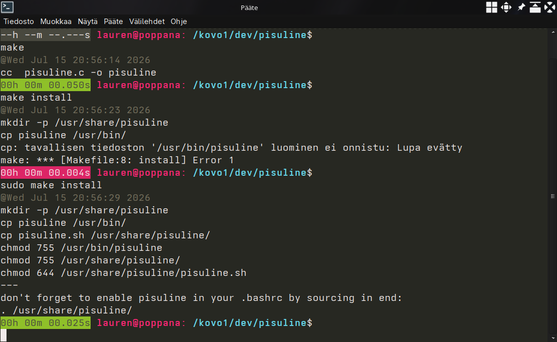

# Pisuline

Simple, tiny yet fancy PS0 and PS1 bashline with execution time tracking
and statuscode coloring.

A picture is worth more than a thousand words.
pisuline.c v1 doesn't have that many words.

